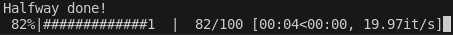

# awdy
Are We Done Yet (awdy) is a tqdm-like progress bar written in pure Mojo.

## Basic usage
```mojo
with awdy(total=100, leave=True) as pb:
    for i in range(100):
        sleep(0.05)
        pb.update()
        if i == 49:
            awdy.write('Halfway done!')
```

Note that because Mojo doesn't support an Iterable trait yet, we can't do something like:
```mojo
for thing in awdy(my_iterable):
    ...
```